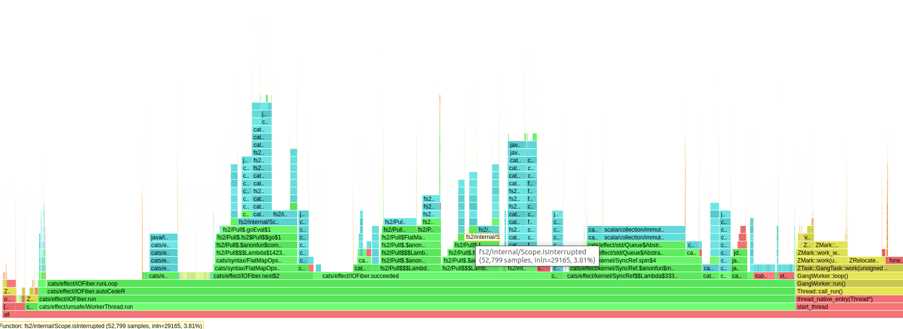
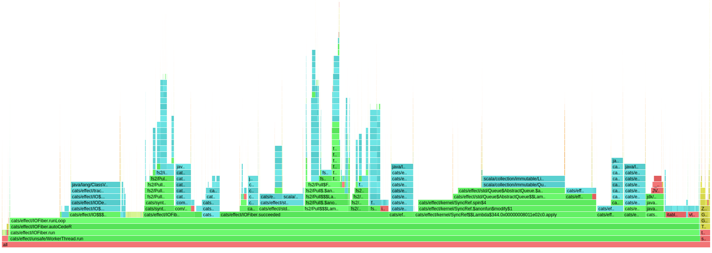

# fs2 tests

Alternative implementation of `Stream.fromQueueUnterminated`, replacing
```scala
  private def fromQueueNoneTerminatedSingletons_[F[_], A](
      take: F[Option[A]],
      tryTake: F[Option[Option[A]]],
      limit: Int
  ): Stream[F, A] = {
    def await: Stream[F, A] =
      Stream.eval(take).flatMap {
        case None => Stream.empty
        case Some(c) =>
          val builder = collection.mutable.Buffer.newBuilder[A]
          builder += c
          pump(1, builder)
      }
    def pump(
        currSize: Int,
        acc: collection.mutable.Builder[A, collection.mutable.Buffer[A]]
    ): Stream[F, A] =
      if (currSize == limit) Stream.emits(acc.result()) ++ await
      else
        Stream.eval(tryTake).flatMap {
          case None => Stream.emits(acc.result()) ++ await
          case Some(Some(c)) =>
            acc += c
            pump(currSize + 1, acc)
          case Some(None) => Stream.emits(acc.result())
        }
    await
  }
```

with 
```scala
def fromUnterminatedQueue[A](q: QueueSource[IO, A]): Stream[IO, A] = Stream.evalSeq(q.tryTakeN(None)).repeat
```

## Test setup

Producer feeds `cats.effect.std.Queue` with 100k timestamps, consumer ingests the queue as an `fs2.Stream` and runs it for effects.
100 concurrent instances of (producer, consumer) pairs. 

## Results

`Stream.fromQueueUnterminated` is almost 80% slower (4s vs 7s, and this only after a long warmup), 
puts more pressure on ZGC (despite pre-allocating and pre-touching 32G of heap).
Flame graphs reside in `results/`.



